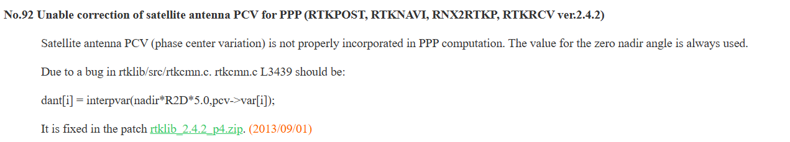

# Intoduction 
It was determined that the initial height disparity between RTKPost / rnx2rtkp and Emlid studio was due to the automatic PCC (Phase Center Correction) that Emlid Studio applies. Because RTK does not perform this action automatically, a height difference of rougly 6.5cm was present between the two pos files. 

# Resolving the issue
## Initial challenges
To apply PCC in RTKPost / rnx2rtkp, you need to provide an ATX and PCV file. Though the files were added to the RTKPost GUI and the configuration file for rnx2rtkp, I was unable to see any corrections. After researching the issue, I learned that there was bug with the current version of RTKLIB I had installed. 

You can either [apply the patches](https://rtklib.com/rtklib_support.htm), or reinstall the most up-to-date version [here](https://github.com/tomojitakasu/RTKLIB).

After recieving the patch, I had no issues from RTKLIB with PCC. 

## Processing with RTK

### Files required
To apply PCC in RTKPost / rnx2rtkp, you need to provide an ATX and PCV file. They can be downloaded from these sites:

Save the following [PCV](https://www.ngs.noaa.gov/ANTCAL/LoadFile?file=ngs20.003) file as **ngs_abs.pcv**

For the [ATX](https://files.igs.org/pub/station/general/) file I recommend downloading **igs20.atx** as it is the newest version.

These files will be referenced in the configuration file, which I have named here **rtklib.conf**. Make sure the path matches. 

### Running the code
- create_pos_rtk.py: Generates a POS file using rnx2rtkp. 

- rtk_emlid_pos-manipulator.py: Compares two different POS files. 

### Data folder
The data folder has the following sub folders which represent the months in 2024:
- 103
- 229
- 504
- 528

Inside 